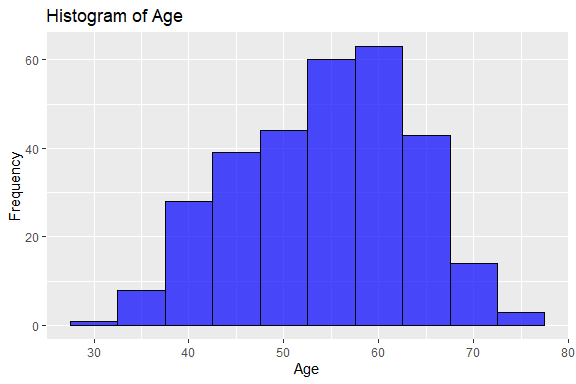

Heart Attack Prediction
================
Trevor Okinda
2024

- [Student Details](#student-details)
- [Setup Chunk](#setup-chunk)
  - [Source:](#source)
  - [Reference:](#reference)
- [Exploratory Data Analysis](#exploratory-data-analysis)
  - [Load dataset](#load-dataset)
  - [Measures of Frequency](#measures-of-frequency)
  - [Measures of Central Tendency](#measures-of-central-tendency)
  - [Measures of Distribution](#measures-of-distribution)
  - [Measures of Relationship](#measures-of-relationship)
  - [ANOVA](#anova)
  - [Plots](#plots)
- [Preprocessing and Data
  Transformation](#preprocessing-and-data-transformation)
  - [Missing Values](#missing-values)
- [Training Model](#training-model)
  - [Data Splitting](#data-splitting)
  - [Cross-validation](#cross-validation)
  - [Train different models](#train-different-models)
  - [Performance Comparison](#performance-comparison)
  - [Bootstrapping](#bootstrapping)
  - [Saving Model](#saving-model)

# Student Details

|                       |                         |
|-----------------------|-------------------------|
| **Student ID Number** | 134780                  |
| **Student Name**      | Trevor Okinda           |
| **BBIT 4.2 Group**    | C                       |
| **Project Name**      | Heart Attack Prediction |

# Setup Chunk

**Note:** the following KnitR options have been set as the global
defaults: <BR>
`knitr::opts_chunk$set(echo = TRUE, warning = FALSE, eval = TRUE, collapse = FALSE, tidy = TRUE)`.

More KnitR options are documented here
<https://bookdown.org/yihui/rmarkdown-cookbook/chunk-options.html> and
here <https://yihui.org/knitr/options/>.

### Source:

The dataset that was used can be downloaded here: *\<<a
href="https://www.kaggle.com/datasets/rashikrahmanpritom/heart-attack-analysis-prediction-dataset?select=heart.csv\"
class="uri">https://www.kaggle.com/datasets/rashikrahmanpritom/heart-attack-analysis-prediction-dataset?select=heart.csv\</a>\>*

### Reference:

*\<Avagyan, Z. (2017). Weather CSV \[Data set\]. Kaggle.
<a href="https://www.kaggle.com/datasets/zaraavagyan/weathercsv\"
class="uri">https://www.kaggle.com/datasets/zaraavagyan/weathercsv\</a>\>  
Refer to the APA 7th edition manual for rules on how to cite datasets:
<https://apastyle.apa.org/style-grammar-guidelines/references/examples/data-set-references>*

# Exploratory Data Analysis

## Load dataset

``` r
# Load necessary libraries
library(tidyverse)
```

    ## ── Attaching core tidyverse packages ──────────────────────── tidyverse 2.0.0 ──
    ## ✔ dplyr     1.1.4     ✔ readr     2.1.4
    ## ✔ forcats   1.0.0     ✔ stringr   1.5.0
    ## ✔ ggplot2   3.5.1     ✔ tibble    3.2.1
    ## ✔ lubridate 1.9.3     ✔ tidyr     1.3.0
    ## ✔ purrr     1.0.2     
    ## ── Conflicts ────────────────────────────────────────── tidyverse_conflicts() ──
    ## ✖ dplyr::filter() masks stats::filter()
    ## ✖ dplyr::lag()    masks stats::lag()
    ## ℹ Use the conflicted package (<http://conflicted.r-lib.org/>) to force all conflicts to become errors

``` r
# Load dataset
heart_attack_data <- read.csv("heart.csv", colClasses = c(
  age = "numeric",           # Age of the patient
  sex = "factor",            # Sex of the patient (0 = female, 1 = male)
  cp = "factor",             # Chest Pain type (1-4)
  trtbps = "numeric",        # Resting blood pressure (in mm Hg)
  chol = "numeric",          # Cholesterol in mg/dl
  fbs = "factor",            # Fasting blood sugar > 120 mg/dl (1 = true, 0 = false)
  restecg = "factor",        # Resting electrocardiographic results (0-2)
  thalachh = "numeric",      # Maximum heart rate achieved
  exng = "factor",           # Exercise induced angina (1 = yes, 0 = no)
  oldpeak = "numeric",       # Oldpeak
  slp = "factor",            # Slope of the peak exercise ST segment (0-2)
  caa = "factor",            # Number of major vessels (0-3)
  thall = "factor",          # Thall (1-3)
  o2_saturation = "numeric", # Oxygen saturation
  output = "factor"          # Target (0 = less chance of heart attack, 1 = more chance of heart attack)
))

# Convert categorical variables to factors with appropriate labels
heart_attack_data <- heart_attack_data %>%
  mutate(
    sex = factor(sex, levels = c(0, 1), labels = c("female", "male")),
    cp = factor(cp, levels = c(1, 2, 3, 4), labels = c("typical angina", "atypical angina", "non-anginal pain", "asymptomatic")),
    fbs = factor(fbs, levels = c(0, 1), labels = c("false", "true")),
    restecg = factor(restecg, levels = c(0, 1, 2), labels = c("normal", "ST-T wave abnormality", "left ventricular hypertrophy")),
    exng = factor(exng, levels = c(0, 1), labels = c("no", "yes")),
    slp = factor(slp, levels = c(0, 1, 2), labels = c("downsloping", "flat", "upsloping")),
    caa = factor(caa, levels = c(0, 1, 2, 3), labels = c("0", "1", "2", "3")),
    thall = factor(thall, levels = c(1, 2, 3), labels = c("normal", "fixed defect", "reversible defect")),
    output = factor(output, levels = c(0, 1), labels = c("less chance of heart attack", "more chance of heart attack"))
  )

# Display the structure of the dataset
str(heart_attack_data)
```

    ## 'data.frame':    303 obs. of  15 variables:
    ##  $ age          : num  63 37 41 56 57 57 56 44 52 57 ...
    ##  $ sex          : Factor w/ 2 levels "female","male": 2 2 1 2 1 2 1 2 2 2 ...
    ##  $ cp           : Factor w/ 4 levels "typical angina",..: 3 2 1 1 NA NA 1 1 2 2 ...
    ##  $ trtbps       : num  145 130 130 120 120 140 140 120 172 150 ...
    ##  $ chol         : num  233 250 204 236 354 192 294 263 199 168 ...
    ##  $ fbs          : Factor w/ 2 levels "false","true": 2 1 1 1 1 1 1 1 2 1 ...
    ##  $ restecg      : Factor w/ 3 levels "normal","ST-T wave abnormality",..: 1 2 1 2 2 2 1 2 2 2 ...
    ##  $ thalachh     : num  150 187 172 178 163 148 153 173 162 174 ...
    ##  $ exng         : Factor w/ 2 levels "no","yes": 1 1 1 1 2 1 1 1 1 1 ...
    ##  $ oldpeak      : num  2.3 3.5 1.4 0.8 0.6 0.4 1.3 0 0.5 1.6 ...
    ##  $ slp          : Factor w/ 3 levels "downsloping",..: 1 1 3 3 3 2 2 3 3 3 ...
    ##  $ caa          : Factor w/ 4 levels "0","1","2","3": 1 1 1 1 1 1 1 1 1 1 ...
    ##  $ thall        : Factor w/ 3 levels "normal","fixed defect",..: 1 2 2 2 2 1 2 3 3 2 ...
    ##  $ o2_saturation: num  98.6 98.6 98.6 98.6 98.1 97.5 97.5 97.5 97.5 97.5 ...
    ##  $ output       : Factor w/ 2 levels "less chance of heart attack",..: 2 2 2 2 2 2 2 2 2 2 ...

``` r
# View the first few rows of the dataset
head(heart_attack_data)
```

    ##   age    sex               cp trtbps chol   fbs               restecg thalachh
    ## 1  63   male non-anginal pain    145  233  true                normal      150
    ## 2  37   male  atypical angina    130  250 false ST-T wave abnormality      187
    ## 3  41 female   typical angina    130  204 false                normal      172
    ## 4  56   male   typical angina    120  236 false ST-T wave abnormality      178
    ## 5  57 female             <NA>    120  354 false ST-T wave abnormality      163
    ## 6  57   male             <NA>    140  192 false ST-T wave abnormality      148
    ##   exng oldpeak         slp caa        thall o2_saturation
    ## 1   no     2.3 downsloping   0       normal          98.6
    ## 2   no     3.5 downsloping   0 fixed defect          98.6
    ## 3   no     1.4   upsloping   0 fixed defect          98.6
    ## 4   no     0.8   upsloping   0 fixed defect          98.6
    ## 5  yes     0.6   upsloping   0 fixed defect          98.1
    ## 6   no     0.4        flat   0       normal          97.5
    ##                        output
    ## 1 more chance of heart attack
    ## 2 more chance of heart attack
    ## 3 more chance of heart attack
    ## 4 more chance of heart attack
    ## 5 more chance of heart attack
    ## 6 more chance of heart attack

``` r
# View the dataset in a separate viewer window
View(heart_attack_data)
```

## Measures of Frequency

``` r
# Function to calculate and print frequency and relative frequency
calculate_frequencies <- function(data, column) {
  freq <- table(data[[column]])
  rel_freq <- prop.table(freq)
  
  freq_df <- data.frame(
    Category = names(freq),
    Frequency = as.numeric(freq),
    Relative_Frequency = as.numeric(rel_freq)
  )
  
  print(freq_df)
}

# Calculate and print frequencies for each categorical variable
categorical_vars <- c("sex", "cp", "fbs", "restecg", "exng", "slp", "caa", "thall", "output")

for (var in categorical_vars) {
  cat("\nFrequencies for", var, ":\n")
  calculate_frequencies(heart_attack_data, var)
}
```

    ## 
    ## Frequencies for sex :
    ##   Category Frequency Relative_Frequency
    ## 1   female        96          0.3168317
    ## 2     male       207          0.6831683
    ## 
    ## Frequencies for cp :
    ##           Category Frequency Relative_Frequency
    ## 1   typical angina        50            0.31250
    ## 2  atypical angina        87            0.54375
    ## 3 non-anginal pain        23            0.14375
    ## 4     asymptomatic         0            0.00000
    ## 
    ## Frequencies for fbs :
    ##   Category Frequency Relative_Frequency
    ## 1    false       258          0.8514851
    ## 2     true        45          0.1485149
    ## 
    ## Frequencies for restecg :
    ##                       Category Frequency Relative_Frequency
    ## 1                       normal       147         0.48514851
    ## 2        ST-T wave abnormality       152         0.50165017
    ## 3 left ventricular hypertrophy         4         0.01320132
    ## 
    ## Frequencies for exng :
    ##   Category Frequency Relative_Frequency
    ## 1       no       204          0.6732673
    ## 2      yes        99          0.3267327
    ## 
    ## Frequencies for slp :
    ##      Category Frequency Relative_Frequency
    ## 1 downsloping        21         0.06930693
    ## 2        flat       140         0.46204620
    ## 3   upsloping       142         0.46864686
    ## 
    ## Frequencies for caa :
    ##   Category Frequency Relative_Frequency
    ## 1        0       175         0.58724832
    ## 2        1        65         0.21812081
    ## 3        2        38         0.12751678
    ## 4        3        20         0.06711409
    ## 
    ## Frequencies for thall :
    ##            Category Frequency Relative_Frequency
    ## 1            normal        18         0.05980066
    ## 2      fixed defect       166         0.55149502
    ## 3 reversible defect       117         0.38870432
    ## 
    ## Frequencies for output :
    ##                      Category Frequency Relative_Frequency
    ## 1 less chance of heart attack       138          0.4554455
    ## 2 more chance of heart attack       165          0.5445545

## Measures of Central Tendency

``` r
# Measures of Central Tendency
central_tendency <- heart_attack_data %>%
  summarize(
    mean_age = mean(age, na.rm = TRUE),
    median_age = median(age, na.rm = TRUE),
    mode_age = as.numeric(names(sort(table(age), decreasing = TRUE)[1])),
    
    mean_trtbps = mean(trtbps, na.rm = TRUE),
    median_trtbps = median(trtbps, na.rm = TRUE),
    mode_trtbps = as.numeric(names(sort(table(trtbps), decreasing = TRUE)[1])),
    
    mean_chol = mean(chol, na.rm = TRUE),
    median_chol = median(chol, na.rm = TRUE),
    mode_chol = as.numeric(names(sort(table(chol), decreasing = TRUE)[1])),
    
    mean_thalachh = mean(thalachh, na.rm = TRUE),
    median_thalachh = median(thalachh, na.rm = TRUE),
    mode_thalachh = as.numeric(names(sort(table(thalachh), decreasing = TRUE)[1])),
    
    mean_oldpeak = mean(oldpeak, na.rm = TRUE),
    median_oldpeak = median(oldpeak, na.rm = TRUE),
    mode_oldpeak = as.numeric(names(sort(table(oldpeak), decreasing = TRUE)[1])),
    
    mean_o2_saturation = mean(o2_saturation, na.rm = TRUE),
    median_o2_saturation = median(o2_saturation, na.rm = TRUE),
    mode_o2_saturation = as.numeric(names(sort(table(o2_saturation), decreasing = TRUE)[1]))
  )

print(central_tendency)
```

    ##   mean_age median_age mode_age mean_trtbps median_trtbps mode_trtbps mean_chol
    ## 1 54.36634         55       58    131.6238           130         120   246.264
    ##   median_chol mode_chol mean_thalachh median_thalachh mode_thalachh
    ## 1         240       197      149.6469             153           162
    ##   mean_oldpeak median_oldpeak mode_oldpeak mean_o2_saturation
    ## 1     1.039604            0.8            0           97.48449
    ##   median_o2_saturation mode_o2_saturation
    ## 1                 97.5               97.5

## Measures of Distribution

``` r
# Measures of Distribution
distribution_measures <- heart_attack_data %>%
  summarize(
    var_age = var(age, na.rm = TRUE),
    sd_age = sd(age, na.rm = TRUE),
    range_age = range(age, na.rm = TRUE),
    
    var_trtbps = var(trtbps, na.rm = TRUE),
    sd_trtbps = sd(trtbps, na.rm = TRUE),
    range_trtbps = range(trtbps, na.rm = TRUE),
    
    var_chol = var(chol, na.rm = TRUE),
    sd_chol = sd(chol, na.rm = TRUE),
    range_chol = range(chol, na.rm = TRUE),
    
    var_thalachh = var(thalachh, na.rm = TRUE),
    sd_thalachh = sd(thalachh, na.rm = TRUE),
    range_thalachh = range(thalachh, na.rm = TRUE),
    
    var_oldpeak = var(oldpeak, na.rm = TRUE),
    sd_oldpeak = sd(oldpeak, na.rm = TRUE),
    range_oldpeak = range(oldpeak, na.rm = TRUE),
    
    var_o2_saturation = var(o2_saturation, na.rm = TRUE),
    sd_o2_saturation = sd(o2_saturation, na.rm = TRUE),
    range_o2_saturation = range(o2_saturation, na.rm = TRUE)
  )

print(distribution_measures)
```

    ##    var_age   sd_age range_age var_trtbps sd_trtbps range_trtbps var_chol
    ## 1 82.48456 9.082101        29   307.5865  17.53814           94 2686.427
    ## 2 82.48456 9.082101        77   307.5865  17.53814          200 2686.427
    ##    sd_chol range_chol var_thalachh sd_thalachh range_thalachh var_oldpeak
    ## 1 51.83075        126     524.6464    22.90516             71    1.348095
    ## 2 51.83075        564     524.6464    22.90516            202    1.348095
    ##   sd_oldpeak range_oldpeak var_o2_saturation sd_o2_saturation
    ## 1   1.161075           0.0         0.1243612        0.3526489
    ## 2   1.161075           6.2         0.1243612        0.3526489
    ##   range_o2_saturation
    ## 1                96.5
    ## 2                98.6

## Measures of Relationship

``` r
# Measures of Relationship
relationship_measures <- heart_attack_data %>%
  summarize(
    cor_age_trtbps = cor(age, trtbps, use = "complete.obs"),
    cor_age_chol = cor(age, chol, use = "complete.obs"),
    cor_age_thalachh = cor(age, thalachh, use = "complete.obs"),
    cor_age_oldpeak = cor(age, oldpeak, use = "complete.obs"),
    cor_age_o2_saturation = cor(age, o2_saturation, use = "complete.obs"),
    
    cor_trtbps_chol = cor(trtbps, chol, use = "complete.obs"),
    cor_trtbps_thalachh = cor(trtbps, thalachh, use = "complete.obs"),
    cor_trtbps_oldpeak = cor(trtbps, oldpeak, use = "complete.obs"),
    cor_trtbps_o2_saturation = cor(trtbps, o2_saturation, use = "complete.obs"),
    
    cor_chol_thalachh = cor(chol, thalachh, use = "complete.obs"),
    cor_chol_oldpeak = cor(chol, oldpeak, use = "complete.obs"),
    cor_chol_o2_saturation = cor(chol, o2_saturation, use = "complete.obs"),
    
    cor_thalachh_oldpeak = cor(thalachh, oldpeak, use = "complete.obs"),
    cor_thalachh_o2_saturation = cor(thalachh, o2_saturation, use = "complete.obs"),
    
    cor_oldpeak_o2_saturation = cor(oldpeak, o2_saturation, use = "complete.obs")
  )

print(relationship_measures)
```

    ##   cor_age_trtbps cor_age_chol cor_age_thalachh cor_age_oldpeak
    ## 1      0.2793509     0.213678       -0.3985219       0.2100126
    ##   cor_age_o2_saturation cor_trtbps_chol cor_trtbps_thalachh cor_trtbps_oldpeak
    ## 1          -0.002251985       0.1231742         -0.04669773          0.1932165
    ##   cor_trtbps_o2_saturation cor_chol_thalachh cor_chol_oldpeak
    ## 1                0.0434903      -0.009939839       0.05395192
    ##   cor_chol_o2_saturation cor_thalachh_oldpeak cor_thalachh_o2_saturation
    ## 1            -0.02287313           -0.3441869                  0.1578013
    ##   cor_oldpeak_o2_saturation
    ## 1                0.03005261

## ANOVA

``` r
# ANOVA for age across different levels of chest pain type (cp)
anova_age_cp <- aov(age ~ cp, data = heart_attack_data)
summary(anova_age_cp)
```

    ##              Df Sum Sq Mean Sq F value Pr(>F)
    ## cp            2    342  170.95   1.879  0.156
    ## Residuals   157  14280   90.95               
    ## 143 observations deleted due to missingness

``` r
# ANOVA for cholesterol (chol) across different levels of sex
anova_chol_sex <- aov(chol ~ sex, data = heart_attack_data)
summary(anova_chol_sex)
```

    ##              Df Sum Sq Mean Sq F value  Pr(>F)    
    ## sex           1  31778   31778   12.27 0.00053 ***
    ## Residuals   301 779523    2590                    
    ## ---
    ## Signif. codes:  0 '***' 0.001 '**' 0.01 '*' 0.05 '.' 0.1 ' ' 1

``` r
# ANOVA for maximum heart rate achieved (thalachh) across different levels of output
anova_thalachh_output <- aov(thalachh ~ output, data = heart_attack_data)
summary(anova_thalachh_output)
```

    ##              Df Sum Sq Mean Sq F value  Pr(>F)    
    ## output        1  28182   28182   65.12 1.7e-14 ***
    ## Residuals   301 130262     433                    
    ## ---
    ## Signif. codes:  0 '***' 0.001 '**' 0.01 '*' 0.05 '.' 0.1 ' ' 1

## Plots

``` r
# Histogram for Age
ggplot(heart_attack_data, aes(x = age)) +
  geom_histogram(binwidth = 5, fill = "blue", color = "black", alpha = 0.7) +
  labs(title = "Histogram of Age", x = "Age", y = "Frequency")
```

<!-- -->

``` r
# Density Plot for Cholesterol
ggplot(heart_attack_data, aes(x = chol)) +
  geom_density(fill = "green", alpha = 0.7) +
  labs(title = "Density Plot of Cholesterol", x = "Cholesterol (mg/dl)", y = "Density")
```

<!-- -->

``` r
# Boxplot for Resting Blood Pressure
ggplot(heart_attack_data, aes(y = trtbps)) +
  geom_boxplot(fill = "orange", color = "black", alpha = 0.7) +
  labs(title = "Boxplot of Resting Blood Pressure", y = "Resting Blood Pressure (mm Hg)")
```

<!-- -->

``` r
# Scatter Plot of Age vs. Maximum Heart Rate, colored by Chest Pain Type
ggplot(heart_attack_data, aes(x = age, y = thalachh, color = cp)) +
  geom_point(alpha = 0.7) +
  labs(title = "Scatter Plot of Age vs. Maximum Heart Rate", x = "Age", y = "Maximum Heart Rate (thalachh)") +
  scale_color_discrete(name = "Chest Pain Type")
```

<!-- -->

``` r
# Boxplot of Cholesterol by Sex
ggplot(heart_attack_data, aes(x = sex, y = chol, fill = sex)) +
  geom_boxplot(alpha = 0.7) +
  labs(title = "Boxplot of Cholesterol by Sex", x = "Sex", y = "Cholesterol (mg/dl)") +
  scale_fill_discrete(name = "Sex")
```

<!-- -->

``` r
# Pair Plot of Selected Numeric Variables
# Load GGally library for ggpairs function
library(GGally)
```

    ## Registered S3 method overwritten by 'GGally':
    ##   method from   
    ##   +.gg   ggplot2

``` r
# Select numeric columns for pair plot
numeric_columns <- heart_attack_data %>%
  select(age, trtbps, chol, thalachh, oldpeak, o2_saturation)

# Create pair plot
ggpairs(numeric_columns, 
        title = "Pair Plot of Selected Numeric Variables")
```

<!-- -->

# Preprocessing and Data Transformation

## Missing Values

``` r
# 1. Check for missing values in each column
missing_values <- colSums(is.na(heart_attack_data))
print(missing_values)
```

    ##           age           sex            cp        trtbps          chol 
    ##             0             0           143             0             0 
    ##           fbs       restecg      thalachh          exng       oldpeak 
    ##             0             0             0             0             0 
    ##           slp           caa         thall o2_saturation        output 
    ##             0             5             2             0             0

``` r
# 2. Summary of missing values across the dataset
missing_summary <- summary(is.na(heart_attack_data))
print(missing_summary)
```

    ##     age             sex              cp            trtbps       
    ##  Mode :logical   Mode :logical   Mode :logical   Mode :logical  
    ##  FALSE:303       FALSE:303       FALSE:160       FALSE:303      
    ##                                  TRUE :143                      
    ##     chol            fbs           restecg         thalachh      
    ##  Mode :logical   Mode :logical   Mode :logical   Mode :logical  
    ##  FALSE:303       FALSE:303       FALSE:303       FALSE:303      
    ##                                                                 
    ##     exng          oldpeak           slp             caa         
    ##  Mode :logical   Mode :logical   Mode :logical   Mode :logical  
    ##  FALSE:303       FALSE:303       FALSE:303       FALSE:298      
    ##                                                  TRUE :5        
    ##    thall         o2_saturation     output       
    ##  Mode :logical   Mode :logical   Mode :logical  
    ##  FALSE:301       FALSE:303       FALSE:303      
    ##  TRUE :2

``` r
library(naniar)  # For visualizing missing data
# 3. Visual representation of missing values
gg_miss_var(heart_attack_data) + 
  labs(title = "Missing Values in Heart Attack Dataset", x = "Variables", y = "Number of Missing Values")
```

<!-- -->

``` r
# Another visual representation using visdat package
# Load visdat package
library(visdat)

# Visualize missing values
vis_miss(heart_attack_data) + 
  labs(title = "Missing Values in Heart Attack Dataset")
```

<!-- -->

``` r
#Remove rows with missing values
heart_attack_data_clean <- na.omit(heart_attack_data)

#Summary of missing values across the cleaned dataset
missing_summary <- summary(is.na(heart_attack_data_clean))
print(missing_summary)
```

    ##     age             sex              cp            trtbps       
    ##  Mode :logical   Mode :logical   Mode :logical   Mode :logical  
    ##  FALSE:155       FALSE:155       FALSE:155       FALSE:155      
    ##     chol            fbs           restecg         thalachh      
    ##  Mode :logical   Mode :logical   Mode :logical   Mode :logical  
    ##  FALSE:155       FALSE:155       FALSE:155       FALSE:155      
    ##     exng          oldpeak           slp             caa         
    ##  Mode :logical   Mode :logical   Mode :logical   Mode :logical  
    ##  FALSE:155       FALSE:155       FALSE:155       FALSE:155      
    ##    thall         o2_saturation     output       
    ##  Mode :logical   Mode :logical   Mode :logical  
    ##  FALSE:155       FALSE:155       FALSE:155

# Training Model

## Data Splitting

``` r
# Load necessary library
library(caret)
```

    ## Loading required package: lattice

    ## 
    ## Attaching package: 'caret'

    ## The following object is masked from 'package:purrr':
    ## 
    ##     lift

``` r
# Set seed for reproducibility
set.seed(123)

# Split the data into training (70%) and testing (30%) sets
train_index <- createDataPartition(heart_attack_data_clean$output, p = 0.7, list = FALSE)
train_data <- heart_attack_data_clean[train_index, ]
test_data <- heart_attack_data_clean[-train_index, ]

# Print the dimensions of the training and testing sets
cat("Training set dimensions:", dim(train_data), "\n")
```

    ## Training set dimensions: 109 15

``` r
cat("Testing set dimensions:", dim(test_data), "\n")
```

    ## Testing set dimensions: 46 15

## Cross-validation

``` r
# Set seed for reproducibility
set.seed(123)

# Define cross-validation control
cv <- trainControl(method = "cv", number = 5, verboseIter = TRUE)

# Your modeling code here (e.g., train a model using caret's train function)
# Example: train a logistic regression model using 5-fold cross-validation
model <- train(output ~ ., data = train_data, method = "glm", family = "binomial", trControl = cv)
```

    ## + Fold1: parameter=none 
    ## - Fold1: parameter=none 
    ## + Fold2: parameter=none 
    ## - Fold2: parameter=none 
    ## + Fold3: parameter=none 
    ## - Fold3: parameter=none 
    ## + Fold4: parameter=none 
    ## - Fold4: parameter=none 
    ## + Fold5: parameter=none 
    ## - Fold5: parameter=none 
    ## Aggregating results
    ## Fitting final model on full training set

``` r
# Print model performance
print(model)
```

    ## Generalized Linear Model 
    ## 
    ## 109 samples
    ##  14 predictor
    ##   2 classes: 'less chance of heart attack', 'more chance of heart attack' 
    ## 
    ## No pre-processing
    ## Resampling: Cross-Validated (5 fold) 
    ## Summary of sample sizes: 87, 87, 87, 88, 87 
    ## Resampling results:
    ## 
    ##   Accuracy  Kappa    
    ##   0.817316  0.4639314

## Train different models

``` r
# Load necessary libraries
library(randomForest)
```

    ## randomForest 4.7-1.1

    ## Type rfNews() to see new features/changes/bug fixes.

    ## 
    ## Attaching package: 'randomForest'

    ## The following object is masked from 'package:dplyr':
    ## 
    ##     combine

    ## The following object is masked from 'package:ggplot2':
    ## 
    ##     margin

``` r
library(e1071)  # For SVM
library(caret)

# Define training control
ctrl <- trainControl(method = "cv", number = 5, verboseIter = TRUE)

# Train Random Forest model
set.seed(123)
rf_model <- train(output ~ ., data = heart_attack_data_clean, method = "rf", trControl = ctrl)
```

    ## + Fold1: mtry= 2 
    ## - Fold1: mtry= 2 
    ## + Fold1: mtry=11 
    ## - Fold1: mtry=11 
    ## + Fold1: mtry=21 
    ## - Fold1: mtry=21 
    ## + Fold2: mtry= 2 
    ## - Fold2: mtry= 2 
    ## + Fold2: mtry=11 
    ## - Fold2: mtry=11 
    ## + Fold2: mtry=21 
    ## - Fold2: mtry=21 
    ## + Fold3: mtry= 2 
    ## - Fold3: mtry= 2 
    ## + Fold3: mtry=11 
    ## - Fold3: mtry=11 
    ## + Fold3: mtry=21 
    ## - Fold3: mtry=21 
    ## + Fold4: mtry= 2 
    ## - Fold4: mtry= 2 
    ## + Fold4: mtry=11 
    ## - Fold4: mtry=11 
    ## + Fold4: mtry=21 
    ## - Fold4: mtry=21 
    ## + Fold5: mtry= 2 
    ## - Fold5: mtry= 2 
    ## + Fold5: mtry=11 
    ## - Fold5: mtry=11 
    ## + Fold5: mtry=21 
    ## - Fold5: mtry=21 
    ## Aggregating results
    ## Selecting tuning parameters
    ## Fitting mtry = 11 on full training set

``` r
# Train Support Vector Machine (SVM) model
set.seed(123)
svm_model <- train(output ~ ., data = heart_attack_data_clean, method = "svmRadial", trControl = ctrl)
```

    ## + Fold1: sigma=0.0006044, C=0.25 
    ## - Fold1: sigma=0.0006044, C=0.25 
    ## + Fold1: sigma=0.0006044, C=0.50 
    ## - Fold1: sigma=0.0006044, C=0.50 
    ## + Fold1: sigma=0.0006044, C=1.00 
    ## - Fold1: sigma=0.0006044, C=1.00 
    ## + Fold2: sigma=0.0006044, C=0.25 
    ## - Fold2: sigma=0.0006044, C=0.25 
    ## + Fold2: sigma=0.0006044, C=0.50 
    ## - Fold2: sigma=0.0006044, C=0.50 
    ## + Fold2: sigma=0.0006044, C=1.00 
    ## - Fold2: sigma=0.0006044, C=1.00 
    ## + Fold3: sigma=0.0006044, C=0.25 
    ## - Fold3: sigma=0.0006044, C=0.25 
    ## + Fold3: sigma=0.0006044, C=0.50 
    ## - Fold3: sigma=0.0006044, C=0.50 
    ## + Fold3: sigma=0.0006044, C=1.00 
    ## - Fold3: sigma=0.0006044, C=1.00 
    ## + Fold4: sigma=0.0006044, C=0.25 
    ## - Fold4: sigma=0.0006044, C=0.25 
    ## + Fold4: sigma=0.0006044, C=0.50 
    ## - Fold4: sigma=0.0006044, C=0.50 
    ## + Fold4: sigma=0.0006044, C=1.00 
    ## - Fold4: sigma=0.0006044, C=1.00 
    ## + Fold5: sigma=0.0006044, C=0.25 
    ## - Fold5: sigma=0.0006044, C=0.25 
    ## + Fold5: sigma=0.0006044, C=0.50 
    ## - Fold5: sigma=0.0006044, C=0.50 
    ## + Fold5: sigma=0.0006044, C=1.00 
    ## - Fold5: sigma=0.0006044, C=1.00 
    ## Aggregating results
    ## Selecting tuning parameters
    ## Fitting sigma = 0.000604, C = 1 on full training set

``` r
# Train Logistic Regression model
set.seed(123)
logit_model <- train(output ~ ., data = heart_attack_data_clean, method = "glm", family = "binomial", trControl = ctrl)
```

    ## + Fold1: parameter=none 
    ## - Fold1: parameter=none 
    ## + Fold2: parameter=none 
    ## - Fold2: parameter=none 
    ## + Fold3: parameter=none 
    ## - Fold3: parameter=none 
    ## + Fold4: parameter=none 
    ## - Fold4: parameter=none 
    ## + Fold5: parameter=none 
    ## - Fold5: parameter=none 
    ## Aggregating results
    ## Fitting final model on full training set

``` r
# Print model results
print(rf_model)
```

    ## Random Forest 
    ## 
    ## 155 samples
    ##  14 predictor
    ##   2 classes: 'less chance of heart attack', 'more chance of heart attack' 
    ## 
    ## No pre-processing
    ## Resampling: Cross-Validated (5 fold) 
    ## Summary of sample sizes: 124, 123, 124, 125, 124 
    ## Resampling results across tuning parameters:
    ## 
    ##   mtry  Accuracy   Kappa    
    ##    2    0.8194892  0.3093248
    ##   11    0.8203226  0.4019685
    ##   21    0.8072043  0.3565106
    ## 
    ## Accuracy was used to select the optimal model using the largest value.
    ## The final value used for the model was mtry = 11.

``` r
print(svm_model)
```

    ## Support Vector Machines with Radial Basis Function Kernel 
    ## 
    ## 155 samples
    ##  14 predictor
    ##   2 classes: 'less chance of heart attack', 'more chance of heart attack' 
    ## 
    ## No pre-processing
    ## Resampling: Cross-Validated (5 fold) 
    ## Summary of sample sizes: 124, 123, 124, 125, 124 
    ## Resampling results across tuning parameters:
    ## 
    ##   C     Accuracy   Kappa     
    ##   0.25  0.7807661  0.00000000
    ##   0.50  0.7807661  0.00000000
    ##   1.00  0.7870161  0.07465565
    ## 
    ## Tuning parameter 'sigma' was held constant at a value of 0.0006044372
    ## Accuracy was used to select the optimal model using the largest value.
    ## The final values used for the model were sigma = 0.0006044372 and C = 1.

``` r
print(logit_model)
```

    ## Generalized Linear Model 
    ## 
    ## 155 samples
    ##  14 predictor
    ##   2 classes: 'less chance of heart attack', 'more chance of heart attack' 
    ## 
    ## No pre-processing
    ## Resampling: Cross-Validated (5 fold) 
    ## Summary of sample sizes: 124, 123, 124, 125, 124 
    ## Resampling results:
    ## 
    ##   Accuracy   Kappa    
    ##   0.8330376  0.5053154

## Performance Comparison

``` r
# Load necessary libraries
library(caret)

# Define resampling method
ctrl <- trainControl(method = "cv", number = 5, verboseIter = TRUE)

# Compare model performance
models <- list(rf = rf_model, svm = svm_model, logit = logit_model)
model_resamples <- resamples(models)

# Summarize results
summary(model_resamples)
```

    ## 
    ## Call:
    ## summary.resamples(object = model_resamples)
    ## 
    ## Models: rf, svm, logit 
    ## Number of resamples: 5 
    ## 
    ## Accuracy 
    ##            Min.   1st Qu.    Median      Mean   3rd Qu.      Max. NA's
    ## rf    0.7419355 0.7500000 0.8064516 0.8203226 0.9000000 0.9032258    0
    ## svm   0.7741935 0.7741935 0.7741935 0.7870161 0.8000000 0.8125000    0
    ## logit 0.7741935 0.8064516 0.8125000 0.8330376 0.8387097 0.9333333    0
    ## 
    ## Kappa 
    ##            Min.   1st Qu.    Median       Mean   3rd Qu.      Max. NA's
    ## rf    0.1788079 0.1847134 0.3059701 0.40196847 0.6666667 0.6736842    0
    ## svm   0.0000000 0.0000000 0.0000000 0.07465565 0.1666667 0.2066116    0
    ## logit 0.3841060 0.3852691 0.4514286 0.50531538 0.5141066 0.7916667    0

## Bootstrapping

``` r
# Set seed for reproducibility
set.seed(123)

# Number of bootstrap iterations
n_bootstraps <- 1000

# Bootstrap function for age variable
bootstrap_age <- replicate(n_bootstraps, {
  # Sample with replacement from the age variable
  bootstrap_sample <- sample(heart_attack_data_clean$age, replace = TRUE)
  
  # Calculate statistic of interest (e.g., mean, median, standard deviation) for each bootstrap sample
  # Mean and standard deviation
  mean_age <- mean(bootstrap_sample)
  sd_age <- sd(bootstrap_sample)
  
  return(c(mean_age, sd_age))
})

# Calculate mean and standard deviation for each bootstrap sample
bootstrap_stats <- t(bootstrap_age)

# Calculate confidence intervals for mean and standard deviation
confidence_intervals <- apply(bootstrap_stats, 2, function(stat) {
  quantile(stat, c(0.025, 0.975))
})

# Print results
cat("Bootstrap Mean Age:", mean(bootstrap_stats[, 1]), "\n")
```

    ## Bootstrap Mean Age: 53.37879

``` r
cat("95% Confidence Interval for Mean Age:", confidence_intervals[1, 1], "-", confidence_intervals[2, 1], "\n")
```

    ## 95% Confidence Interval for Mean Age: 51.90855 - 54.80661

``` r
cat("Bootstrap Standard Deviation Age:", mean(bootstrap_stats[, 2]), "\n")
```

    ## Bootstrap Standard Deviation Age: 9.550453

``` r
cat("95% Confidence Interval for Standard Deviation Age:", confidence_intervals[1, 2], "-", confidence_intervals[2, 2], "\n")
```

    ## 95% Confidence Interval for Standard Deviation Age: 8.703173 - 10.37451

## Saving Model

``` r
# Saving the Random Forest model for the heart attack dataset
saveRDS(rf_model, file = "./models/heart_attack_rf_model.rds")

# Load the saved Random Forest model
loaded_heart_attack_rf_model <- readRDS("./models/heart_attack_rf_model.rds")

# Prepare new data for prediction (adjusting for factor conversions)
new_heart_attack_data <- data.frame(
  age = c(63, 37, 41),   # Example age values
  sex = factor(c(1, 1, 0), levels = c(0, 1), labels = c("female", "male")),  # Adjusted sex values
  cp = factor(c(3, 2, 1), levels = c(1, 2, 3, 4), labels = c("typical angina", "atypical angina", "non-anginal pain", "asymptomatic")),  # Adjusted cp values
  trtbps = c(145, 130, 130),  # Example trtbps values
  chol = c(233, 250, 204),    # Example chol values
  fbs = factor(c(1, 0, 0), levels = c(0, 1), labels = c("false", "true")),      # Adjusted fbs values
  restecg = factor(c(0, 1, 0), levels = c(0, 1, 2), labels = c("normal", "ST-T wave abnormality", "left ventricular hypertrophy")),  # Adjusted restecg values
  thalachh = c(150, 187, 172),  # Example thalachh values
  exng = factor(c(0, 0, 0), levels = c(0, 1), labels = c("no", "yes")),     # Adjusted exng values
  oldpeak = c(2.3, 3.5, 1.4),   # Example oldpeak values
  slp = factor(c(0, 0, 2), levels = c(0, 1, 2), labels = c("downsloping", "flat", "upsloping")),      # Adjusted slp values
  caa = factor(c(0, 0, 2), levels = c(0, 1, 2, 3), labels = c("0", "1", "2", "3")),      # Adjusted caa values
  thall = factor(c(1, 2, 2), levels = c(1, 2, 3), labels = c("normal", "fixed defect", "reversible defect")),    # Adjusted thall values
  o2_saturation = c(98.6, 98.6, 98.6)  # Example o2_saturation values
)

# Use the loaded model to make predictions for new heart attack data
predictions_rf_loaded_model <- predict(loaded_heart_attack_rf_model, newdata = new_heart_attack_data)

# Print predictions
print(predictions_rf_loaded_model)
```

    ## [1] more chance of heart attack more chance of heart attack
    ## [3] more chance of heart attack
    ## Levels: less chance of heart attack more chance of heart attack
